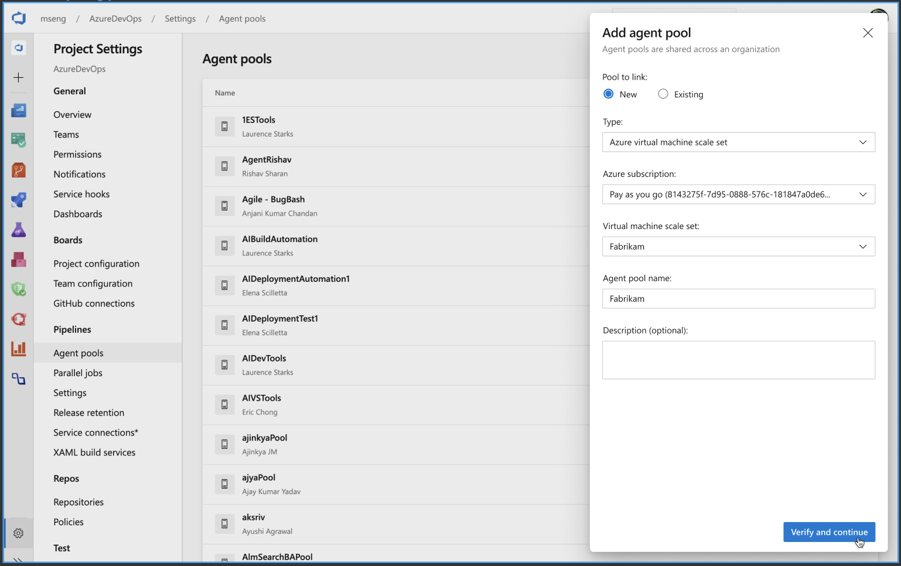
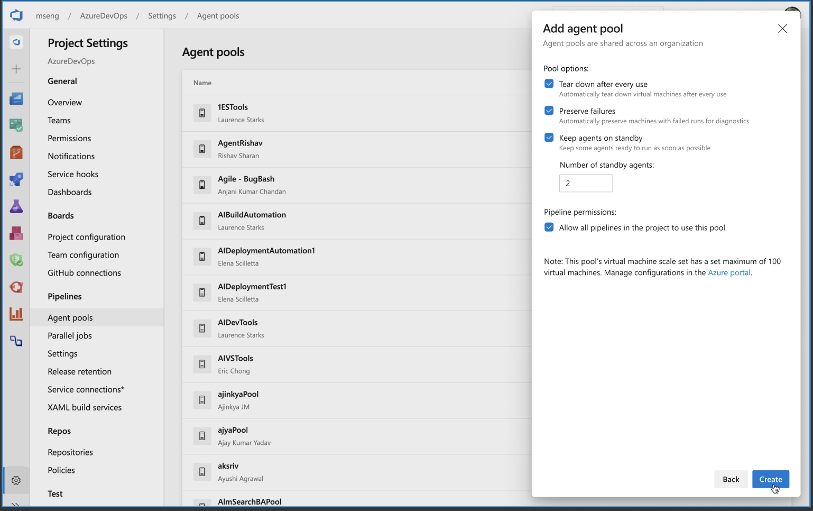

# Elastic Self-hosted Agent Pools (formerly "BYOS: Bring Your Own Subscription Agent Pools")

Microsoft-hosted agents are extremely convenient: low/no cost, no infrastructure to maintain, and elastic with demand.
In return, customers must give up control over tools, capacity, and speed.
On the other end of the spectrum, self-hosted agents offer the exact opposite set of trade-offs: full control over everything, at the expense of maintaining and paying for infrastructure.
With self-hosted agents, elasticity is difficult to achieve.

Elastic self-hosted pools represent a middle ground:
they pair the convenience and elastic capacity of the Microsoft-hosted pool with the control and flexibility of self-hosted agents.
**Azure Pipelines will manage agents to the customer's specification, completely automated, in the customer's Azure subscription.**

## State of this spec

This is in the early design phase and we are looking for feedback in the PR (or as issues in the repo).

## Customer scenarios

The theme throughout these scenarios is that the customer wants hosted elasticity but customization beyond what Microsoft-hosted offers.

General themes are around:
- VM specs (memory, CPU, disk) and network environment
- Preinstalled software
- Agent lifecycle
- Auto-scaling
- On-premises customers have often asked us for access to the Microsoft-hosted pools.
In lieu of that (which complicates billing and technical design), this feature must be available to Azure DevOps Server customers.

### VM specs and environment

1. Customer wants more memory, more processor, or more IO than our native images.
2. [Customer](https://github.com/MicrosoftDocs/vsts-docs/issues/2985) wants an NCv2 VM with particular instruction sets for machine learning. (It's niche enough that we won't stand up dedicated hosted pools, but broad enough to be very interesting for our business.)
3. Customer wants additional storage attached to the VM.
4. Customer wants to deploy to a private App Service. It's in a private VNET with no inbound connectivity.
5. Customer wants to open corporate firewall to specific IP addresses so that Microsoft-hosted agents can communicate with their servers. The IP address range for Microsoft-hosted agents changes every week.
6. Customer wants to restrict network connectivity of agent machines and allow them to reach only approved sites.

### Preinstalled software

1. Customer wants Windows 2016 with VS 2019 Preview. (We only offer certain combos like Win2016 + VS2017 and Win2019 + VS2019.)
2. Customer wants to pin a specific set of tools and dependencies, preconfigured on the image.
3. Customer wants extreme control over the exact OS build, settings, versions, and so on.

### Agent lifecycle

1. Customer wants to run several consecutive jobs on an agent to take advantage of incremental source and machine-level package caches.
2. Customer wants to recycle agent machines every night or after every N jobs to clean up the accumulated "detritus" and reduce flakiness in build.
3. Customer uses agents to build untrusted code and hence wants to recycle the agent after every job.
4. Customer wants to run a cleanup script after every job instead of a full-blown recycle.
5. Customer wants to run additional configuration or cache warmup before an agent beings accepting jobs.
6. Customer wants to keep the agent machines for some time after a failure in order to debug the failure.

### Auto-scaling

1. Customer wants to de-provision agents machines that are not being used for running jobs.
1. At the same time, customer does not want us to wait to provision new agents until after a job has been scheduled. Customer wants to get this flexibility by setting some limits:
   - Minimum number of idle machines (to ensure that there are machines readily available to service new jobs as they arrive).
   - Maximum number of machines (to ensure that we do not exceed the max budget constraints).
1. Customer wants to set different limits for different times in the day to handle peak and off-peak loads.

### On-premises customers

1. Customer wants to use Azure DevOps Server with elastic agent pools.

## Industry review

Similar problem spaces:
- [Jenkins can use Azure agents](https://docs.microsoft.com/en-us/azure/jenkins/jenkins-azure-vm-agents) this way
- [AppVeyor](https://www.appveyor.com/docs/server/running-builds-on-azure/) offers instructions for solving a similar problem on several cloud providers
- GitLab CI/CD offers auto-scaling of builder containers using [Docker Machine](https://gitlab.com/gitlab-org/gitlab-runner/blob/master/docs/configuration/autoscale.md) or [Kubernetes](https://docs.gitlab.com/runner/executors/kubernetes.html).

Not offered:
- [Travis CI](https://docs.travis-ci.com/user/enterprise/setting-up-travis-ci-enterprise/) offers an enterprise product that you can install on your own infrastructure. While you can choose what kind of VM to run it on, there's no elasticity.
- [CircleCI](https://circleci.com/docs/2.0/aws/#nomad-clients) offers an on-your-infrastructure product. You must scale up and down the workers manually, there's no elasticity.

## Solution

For starters, this is about running agents on VMs in Azure.
Later, we may consider whether this same solution works for:
- AKS
- Any Kubernetes
- Other clouds

### VM scale sets

The mechanism under the hood being considered for managing virtual machines in Azure is VM scale sets (VMSS). 

[VM scale sets](https://docs.microsoft.com/en-us/azure/virtual-machine-scale-sets/overview) have the following benefits:

•	Easy to create and manage a large number of virtual machines with the same base OS image and configuration.
•	Customer can pick one of the standard images, create their own [custom image](https://docs.microsoft.com/en-us/azure/virtual-machine-scale-sets/tutorial-use-custom-image-cli), or install their own software on top of a standard image using [script extensions](https://docs.microsoft.com/en-us/azure/virtual-machine-scale-sets/tutorial-install-apps-cli).
•	Customer can pick a [size](https://docs.microsoft.com/en-us/azure/virtual-machines/windows/sizes?toc=https%3A%2F%2Fdocs.microsoft.com%2Fen-us%2Fazure%2Fvirtual-machine-scale-sets%2FTOC.json&bc=https%3A%2F%2Fdocs.microsoft.com%2Fen-us%2Fazure%2Fbread%2Ftoc.json) for their virtual machines.
•	Customer can use [availability zones](https://docs.microsoft.com/en-us/azure/availability-zones/az-overview) to distribute VM instances in a scale set across multiple data centers.
•	Customer can configure [networking](https://docs.microsoft.com/en-us/azure/virtual-machine-scale-sets/virtual-machine-scale-sets-networking) for VMs in their scale set.
•	Customer can schedule automatic [OS image updates](https://docs.microsoft.com/en-us/azure/virtual-machine-scale-sets/virtual-machine-scale-sets-automatic-upgrade).
•	Customer can use standard Azure policies to control various settings in the scale set.
•	Azure Pipelines can easily grow or shrink the number of virtual machines in the scale set.

Azure has a good [marketplace](https://azuremarketplace.microsoft.com/en-us/marketplace/apps?filters=virtual-machine-images) of images that customers can start with for their base images. These include Windows Server, Ubuntu, Debian based images, Windows server with Visual Studio, etc.
In addition, wherever possible, we should publish our Microsoft-hosted images to this marketplace. There are some licensing constraints that prevent us from publishing all the software though.

### Setup

For a lot of customers, it would be enough to have them
- go to pool setup
- create a new pool, and select the option to use Azure VMs
- pick an Azure subscription, a VM scale set + a few different agent lifetime policies
- have Azure Pipelines configure it all for them

Some initial conceptual designs:

