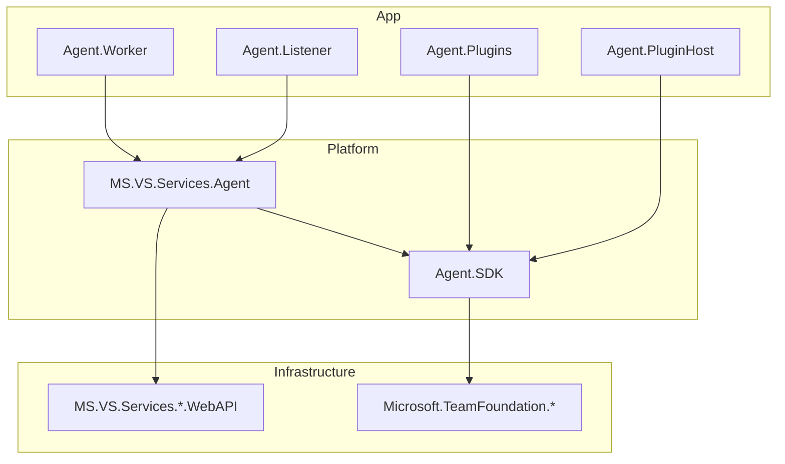

# Architectural Layers of the Agent Code

`Agent.Listener`, `Agent.Worker`, `Agent.PluginHost`, and `Agent.Plugins` are at the top.
They do not depend on each other.

`Agent.Listener` and `Agent.Worker` both depend on `Microsoft.VisualStudio.Services.Agent`.
(This could likely be renamed `Agent.Core` or `Agent.Common` for more clarity.)

All of the assemblies mentioned so far depend on `Agent.Sdk`, and many of them depend on the various `Microsoft.VisualStudio.Services.*` web APIs.
Additionally, `Agent.SDK` depends on some `Microsoft.TeamFoundation.*` assemblies.

## Diagram

In rough terms, dependencies look like this:

